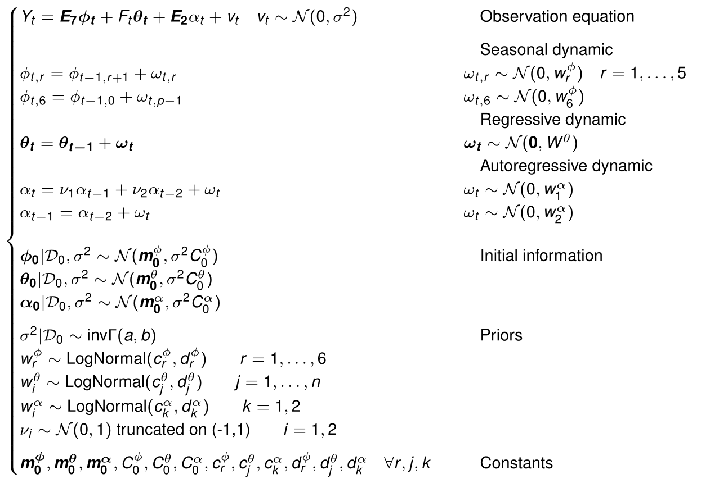
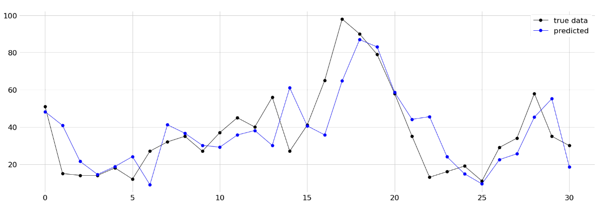

# A bayesian approach to time series forecasting

## The problem

The aim of the project is to predict future values of Particulate Matter in Milan using bayesian tools. In Lombardia, ARPA is the institutional agency in charge of measuring and publishing certified air quality data. ARPA’s measures are based on accurate sensing stations. The main issue of these stations is the fact they are costly and bulky, so few of them can be deployed (2 in Milan for PM2.5). Wiseair is a startup company that has designed new sensors that are low-cost, user-friendly and easy to install: Arianna.
The project focus on an univariate analysis since consider only one sensor from the many installed by Wiseair.

## Installation

Check to have miniconda properly installed on your system. Then set up a conda environment: from your terminal run the following command
```
conda create --name AirQualityForecasting python=3.8
```
this will create a conda environment to keep the workspace in isolation from your system binaries. 
To install tensorflow and tensorflow-probability run
```
conda activate AirQualityForecasting
pip install --upgrade tensorflow
pip install --upgrade tensorflow-probability
```
## Project structure

Project is organized as follow
* **src**: contains all the source code to run the models
  * **libs**: contains external libraries, for example the interface to Wiseair servers
  * **modelFiles**: contains .stan and .bug model files 
* **docs**: contains jupyter notebooks presenting our results in a convinient way for the reader, as well as mathematical proofs and models.
* **data**: contains all .csv used as data

## Notebooks 
In the **docs** folder you can find a set of files summarizing all our analysis without the pain of making long simulation runs. You can see them directly on Github or for a better rendering open them using [Jupyter](https://jupyter.org/).

### Data collection and exploration

* [DataCollection](https://github.com/AlePalu/AirQualityForecasting/blob/master/docs/1-DataCollection.ipynb): We interface to Wiseair servers to collect data for the interested period. Remove useless features for statistical analysis and make an hourly aggregation to have data sampled with an uniform frequency. Finally integration of weather conditions using ARPA data is done. At the end the dataset in CSV format is produced (Written in python so to be able to interface with data servers).

### Classical time series models

We start by trying to forecast our data using well known and simple models. We do not expect to obtain great results, since all models presented in this section work under the stationary assumption and data to forecast are not stationary. Take the content of this section as a warmup.

You can see and run the source code in the **src** directory for AR, ARX and SARX models.

### Dynamic Linear Models

* [Dynamic Linear Model](): We set up a dynamic linear model to forecast the series of particulate matter. We use STS model of tensorflow probability to build and train the model.

## Final proposed model and conclusions

The final model is a dynamic linear model obtained as a superposition of simple model blocks, in particular our model is composed by:

* **Seasonal component**: We introduce 7 latent variables, one for each day of the week, whose dynamics is described by a form free seasonal effect DLM.
* **Autoregressive component**: we suppose that the value of PM at time t is not independent from the value of PM registered during the past days. For this reason we introduce an autoregressive dynamic of order 2.
* **Regressive component**: The following regressors are supplied to the model
  * temperature
  * humidity
  * wind
  * wind direction
  * rainfall intensity
  * global solar radiation

The model is formally described by the following system



The one step predictive distribution is reported in the following picture



The model is not able to correctly forecast the presence of peaks while is quite good in adapting for a decrease of the levels of PM. Indeed weather conditions are often related to a decrease of the level of pollutants instead of an increase. Adding more information to forecast an increase of the level of pollutants may increase the forecast capabilities of the model.
